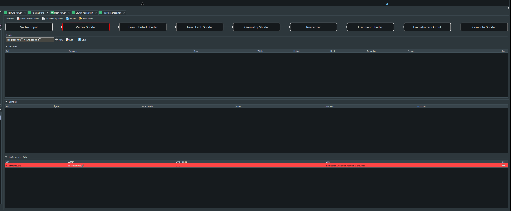
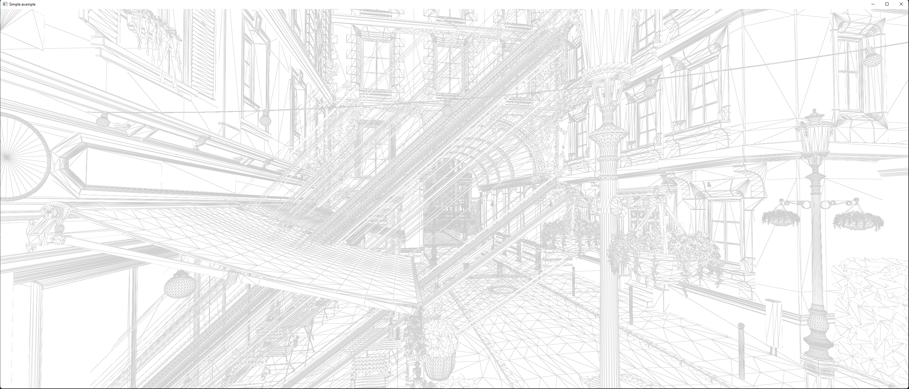
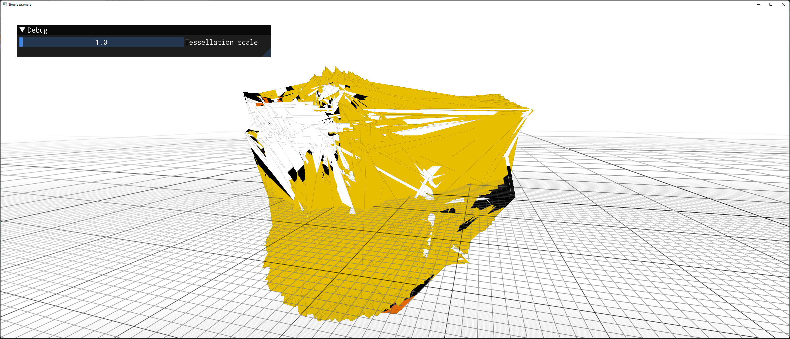
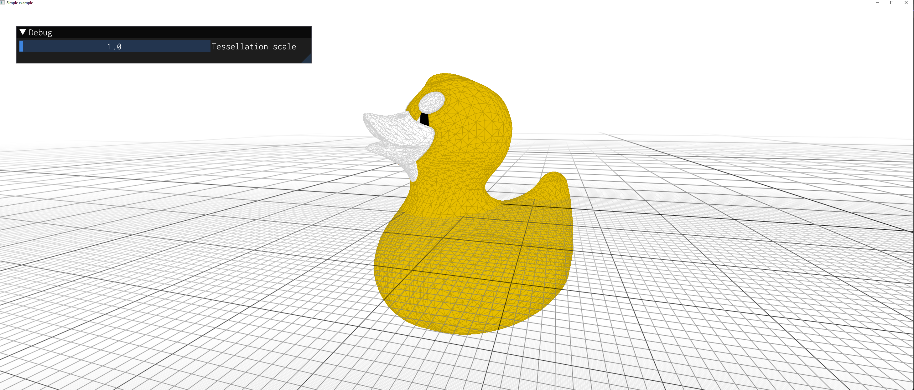

# 3D OpenGL Engine

Before testing out the final model, remember to apply the patch. 

## Getting Started

Copy `vendor/src/bistro/PatchedMaterials/XXX.mtl` into `vendor/src/bistro/Exterior/XXX.mtl` and `vendor/src/bistro/Interior/XXX.mtl`. Overwrite if necessary (to fix the materials)


`cmake -S . -B ./build/Win64 -G "Visual Studio 17 2022" -A x64`

## Points of Interest

- `#!/usr/bin/python3` is a shebang line. For unix based OS, this line defines where the interpreter is located such that we can run the script using `./script.py`. Otherwise, we need to use `python3 script.py`. On the other hand, Windows has its own rules for figuring out how to run the script (using filename extensions). So the shebang line has no effects in this case. https://stackoverflow.com/q/7670303/13795171

- `${CMAKE_SOURCE_DIR}` vs `${CMAKE_CURRENT_SOURCE_DIR}`: `CMAKE_SOURCE_DIR` is where cmake was originally invoked, and `CMAKE_CURRENT_SOURCE_DIR` is where cmake is currently working.
- When adding lib to `json`, remember to use `v` + version number for assimp. 

---

```glsl
layout (std140, binding = 0) uniform PerFrameData
{
	uniform mat4 mvp;
	uniform int isWireFrame;
}  // Notice here: missing semicolon! nothing shows up on screen
```

---


## Features

- Direct-State-Access (DSA) programming model
- Programmable vertex pulling (PVP) data storage approach
- `ARB_bindless_texture`, `ARB_multi_draw_indirect` (MDI), `ARB_indirect_
- HDR Cube map: 6 faces or equirectangular format or vertical/horizontal cross
- Custom mesh preprocessing pipeline 
- Real-time discrete LOD algorithms
- Dynamic LOD based on tessellation
- Physically based rendering (PBR) using glTF 2.0 shading model
  - precomputing irradiance maps
  - Bidirectional reflectance distribution function (BRDF) lookup tables (LUTs)
- A data-oriented (DOD) scene graph


## Samples

| Name                                                         | Screenshot                                                   | Description                                                  |
| ------------------------------------------------------------ | ------------------------------------------------------------ | ------------------------------------------------------------ |
| 01HelloWorld                                                 |                                                              | "Hello World"                                                |
| 02HelloTriangle                                              |                                                              |                                                              |
| SSAO                                                         |                                                              |                                                              |
| [Shadow Mapping](https://github.com/zixin96/d3d12book/blob/master/Chapter%2020%20Shadow%20Mapping/Shadows) |  | This demo shows a basic implementation of the shadow mapping algorithm. |


## Credits

- https://github.com/KhronosGroup/glTF-Sample-Viewer/tree/glTF-WebGL-PBR
- https://github.com/PacktPublishing/3D-Graphics-Rendering-Cookbook
- https://learnopengl.com/


### PVP: Vertex or Vertex and Index Pulling? 

> I’ve also shown that programmable vertex pulling can only be prohibitive from a performance point of view if we are using programmable indexed primitive rendering, as in this case the lack of post-transform vertex cache utilization can dramatically decrease the performance. - OpenGL Insights

Pulling index could be detrimental to performance. 

### ImGui Interaction and Camera

```c++
gPositioner.update(app.getDeltaSeconds(),
		                   gMouseState.pos,
		                   gMouseState.pressedLeft && !io.WantCaptureMouse); // "&& !io.WantCaptureMouse" part prevents camera from moving when we interact with imgui
```


### Bloopers

Nothing shows up on the screen. What happened??? In this case, we forgot to bind the perframe uniform buffer. RenderDoc can help us to that "No Resource" has been bound to PerFrame

1. Use RenderDoc
2. Use RenderDoc
3. Use RenderDoc



---

Bug: 



Fix: 

Instead of: 

```c++
for (size_t i = 0; i != m->mNumFaces; i++)
{
    const aiFace& f = m->mFaces[i];
    gMeshData.indexData.push_back(f.mIndices[0] + gVertexOffset);
    gMeshData.indexData.push_back(f.mIndices[1] + gVertexOffset);
    gMeshData.indexData.push_back(f.mIndices[2] + gVertexOffset);
}
```

, Do this: 

```c++
for (size_t i = 0; i != m->mNumFaces; i++)
{
    // skip if number of indices in this face is not equal to 3!
    if (m->mFaces[i].mNumIndices != 3) { continue; }
    const aiFace& f = m->mFaces[i];
    gMeshData.indexData.push_back(f.mIndices[0] + gVertexOffset);
    gMeshData.indexData.push_back(f.mIndices[1] + gVertexOffset);
    gMeshData.indexData.push_back(f.mIndices[2] + gVertexOffset);
}
```

---

WAT THE DUCK??: 



```glsl
struct VertexData
{
    float pos[3];
    float tc[3]; //!!!! Should be float tc[2]
};
```

Fix:



---

Bug: A particular material "Metal_RollDoor" has the wrong file and directory name causing the following directory iterator returns "directory not found" error. 

```c++
std::string findSubstitute(const std::string& origFile)
{
...
	for (auto& p : fs::directory_iterator(dir)) // dir not found
...
}
```

Fix: Remove extra spaces in the `.mtl` file

How to track this bug: 

```c++
if (aiGetMaterialTexture(M,
                         aiTextureType_DIFFUSE,
                         0,
                         &Path,
                         &Mapping,
                         &UVIndex,
                         &Blend,
                         &TextureOp,
                         TextureMapMode,
                         &TextureFlags) == AI_SUCCESS)
{
    const std::string albedoMap  = std::string(Path.C_Str());
    const std::string debugMetal = "RollDoor";

    if (albedoMap.find(debugMetal) != std::string::npos)
    {
        printf("Stop!"); // set break point here to see the Path is actually wrong, and this is the first time Path has been set, so the issue must be in the source file (.obj)
    }
...
}
```

