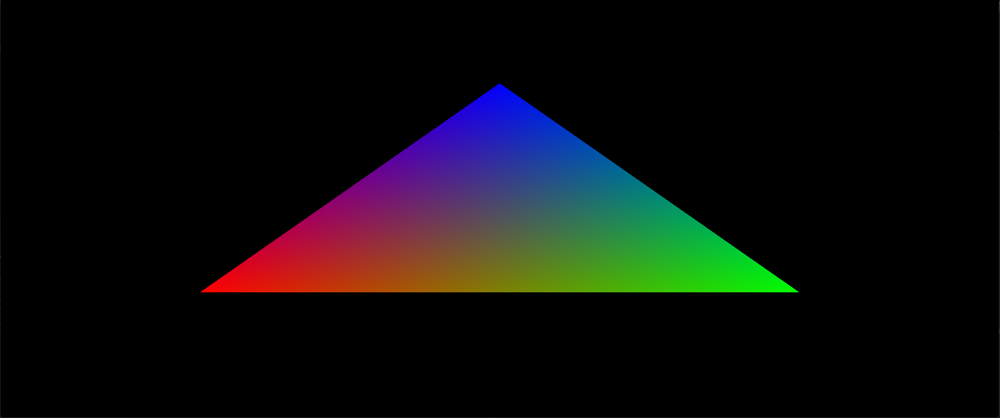
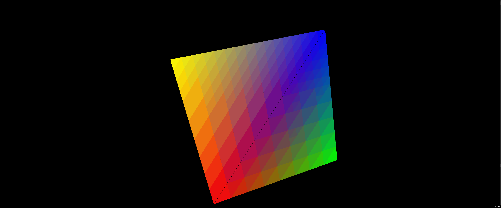
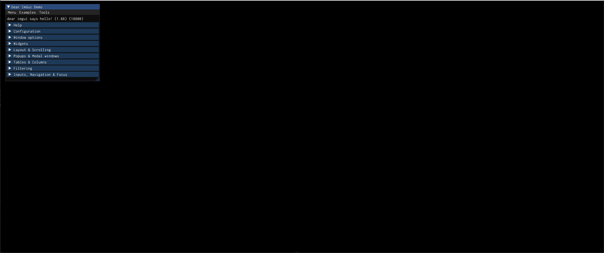
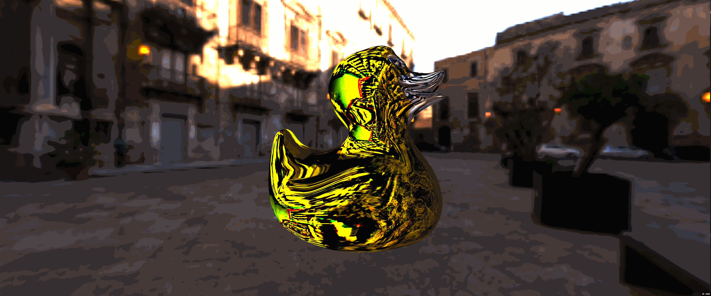

# 3D OpenGL Engine

3D OpenGL Engine is my hobby engine to try new ideas and rendering techniques. 

## Getting Started

```
git clone https://github.com/zixin96/3DEngineOpenGL.git
```

### Windows Build Instructions

```
cmake -S . -B ./build/Win64 -G "Visual Studio 17 2022" -A x64
```

### Optional Bistro Scene Modifications

Before testing out the Bistro model, remember to apply the patches. 

Copy `vendor/src/bistro/PatchedMaterials/exterior.mtl` into `vendor/src/bistro/Exterior/exterior.mtl` 

Copy `vendor/src/bistro/PatchedMaterials/interior.mtl` into `vendor/src/bistro/Interior/interior.mtl` 

## Features

- OpenGL 4.6 based
  - Direct-State-Access (DSA) programming model
  - `ARB_bindless_texture`, `ARB_multi_draw_indirect` (MDI), `ARB_indirect_parameters`
    - `glMultiDrawElementsIndirect`
- `.obj` and `.gltf` loading
- Programmable vertex pulling (PVP) data storage approach
- HDR Cube map: 6 faces or equirectangular format or vertical/horizontal cross
- Custom mesh preprocessing pipeline 
- Dynamic LOD based on tessellation shaders
- Physically-based rendering (PBR) using glTF 2.0 shading model
- A data-oriented (DOD) scene graph
- Shadow mapping for spot light with percentage-closer filtering (PCF)
- Postprocessing pipeline
  - SSAO
- Offscreen rendering
- fullscreen quad rendering
- Image-based Lighting (IBL)


## Samples

| Name                                                         | Screenshot                                                   | Description                                                  |
| :----------------------------------------------------------- | :----------------------------------------------------------- | ------------------------------------------------------------ |
| 01 HelloWorld                                                | "Hello World"                                                | "Hello World"                                                |
| 02 HelloTriangle                                             |  | Hello Triangle                                               |
| 03 Cube                                                      |          | Let's draw a rotating 3D cube with wire frame contours.      |
| 03 Cube Optimized                                            |          | This demo improves upon 02 Cube by uploading the entire per-frame data once and binding the correct instance before each draw call. In more complicated real-world use cases, this approach is more desirable. |
| 04 Texture Mapping                                           |      | This demo shows how to use the new **DSA** model to do **texture mapping**. |
| 05 ImGui                                                     |  | A minimalistic implementation of **ImGui** rendering.        |
| 06 Duck                                                      |          | This demo shows the process of loading a **gltf 2.0** model using **Assimp**. |
| 07 Vertex Pulling                                            |    | This demo implements **programmable vertex pulling (PVP)**. We store vertices inside a shader storage buffer and read that data manually in the vertex shader. We also create a nice anti-aliased wireframe overlay on top of the colored mesh. |
| 08 Vertex and Index Pulling                                  |  | This demo implements **programmable vertex and index pulling**. We store vertices inside a shader storage buffer and indices inside another shader storage buffer. We read both data manually in the vertex shader. Compared with 07VertexPulling, this demo doesn't use index drawing (since we are pulling indices inside a storage buffer). Thus, instead of calling `glDrawElements`, we need to call `glDrawArrays` and specify the number of indices to draw. |
| 09 Cube Map                                                  |    | This demo renders a reflective duck with a cube map texture and Schlick's approximation. |
| 10 Mesh Optimizer                                            |    | This demo renders two optimized duck meshes with different LOD levels. The meshes are optimized using [meshoptimizer](https://github.com/zeux/meshoptimizer). |
| 11 Infinite Grid                                             |  | This demo renders an infinite grid on the xz plane used for debugging purposes. |
| 12 Large Scene                                               |  | This demo renders a large scene using a custom scene conversion tool (`Tools/SceneConversionTool`). |
| 13                                                           |                                        |                                                              |
| SSAO                                                         |  |                                                              |
| [Shadow Mapping](https://github.com/zixin96/d3d12book/blob/master/Chapter%2020%20Shadow%20Mapping/Shadows) |                                                              | This demo shows a basic implementation of the shadow mapping algorithm. |

## Dependencies

- rapidjson
- gli
- glTF-Sample-Models
- argh
- meshoptimzer
- assimp
- imgui
- stb
- glm
- glfw
- glad

## Credits

- https://github.com/KhronosGroup/glTF-Sample-Viewer/tree/glTF-WebGL-PBR
- https://github.com/PacktPublishing/3D-Graphics-Rendering-Cookbook
- https://learnopengl.com/
- http://www.opengl-redbook.com/


## Notes

### PVP: Vertex or Vertex and Index Pulling? 

> I’ve also shown that programmable vertex pulling can only be prohibitive from a performance point of view if we are using programmable indexed primitive rendering, as in this case the lack of post-transform vertex cache utilization can dramatically decrease the performance. - OpenGL Insights

Pulling index could be detrimental to performance. 

### ImGui Interaction and Camera

```c++
gPositioner.update(app.getDeltaSeconds(),
		                   gMouseState.pos,
		                   gMouseState.pressedLeft && !io.WantCaptureMouse); // "&& !io.WantCaptureMouse" part prevents camera from moving when we interact with imgui
```

### Points of Interest

- `#!/usr/bin/python3` is a shebang line. For unix based OS, this line defines where the interpreter is located such that we can run the script using `./script.py`. Otherwise, we need to use `python3 script.py`. On the other hand, Windows has its own rules for figuring out how to run the script (using filename extensions). So the shebang line has no effects in this case. https://stackoverflow.com/q/7670303/13795171

- `${CMAKE_SOURCE_DIR}` vs `${CMAKE_CURRENT_SOURCE_DIR}`: `CMAKE_SOURCE_DIR` is where cmake was originally invoked, and `CMAKE_CURRENT_SOURCE_DIR` is where cmake is currently working.
- When adding lib to `json`, remember to use `v` + version number for assimp. 

---

```glsl
layout (std140, binding = 0) uniform PerFrameData
{
	uniform mat4 mvp;
	uniform int isWireFrame;
}  // Notice here: missing semicolon! nothing shows up on screen
```

## Bloopers

Nothing shows up on the screen. What happened??? In this case, we forgot to bind the per-frame uniform buffer. RenderDoc can help us to that "No Resource" has been bound to PerFrame

RenderDoc: 


---

Bug: 


Fix: 

Instead of: 

```c++
for (size_t i = 0; i != m->mNumFaces; i++)
{
    const aiFace& f = m->mFaces[i];
    gMeshData.indexData.push_back(f.mIndices[0] + gVertexOffset);
    gMeshData.indexData.push_back(f.mIndices[1] + gVertexOffset);
    gMeshData.indexData.push_back(f.mIndices[2] + gVertexOffset);
}
```

, Do this: 

```c++
for (size_t i = 0; i != m->mNumFaces; i++)
{
    // skip if number of indices in this face is not equal to 3!
    if (m->mFaces[i].mNumIndices != 3) { continue; }
    const aiFace& f = m->mFaces[i];
    gMeshData.indexData.push_back(f.mIndices[0] + gVertexOffset);
    gMeshData.indexData.push_back(f.mIndices[1] + gVertexOffset);
    gMeshData.indexData.push_back(f.mIndices[2] + gVertexOffset);
}
```

---

WAT THE DUCK??: 


```glsl
struct VertexData
{
    float pos[3];
    float tc[3]; //!!!! Should be float tc[2]
};
```

Fix:


---

Bug: A particular material "Metal_RollDoor" has the wrong file and directory name causing the following directory iterator returns "directory not found" error. 

```c++
std::string findSubstitute(const std::string& origFile)
{
...
	for (auto& p : fs::directory_iterator(dir)) // dir not found
...
}
```

Fix: Remove extra spaces in the `.mtl` file

How to track this bug: 

```c++
if (aiGetMaterialTexture(M,
                         aiTextureType_DIFFUSE,
                         0,
                         &Path,
                         &Mapping,
                         &UVIndex,
                         &Blend,
                         &TextureOp,
                         TextureMapMode,
                         &TextureFlags) == AI_SUCCESS)
{
    const std::string albedoMap  = std::string(Path.C_Str());
    const std::string debugMetal = "RollDoor";

    if (albedoMap.find(debugMetal) != std::string::npos)
    {
        printf("Stop!"); // set break point here to see the Path is actually wrong, and this is the first time Path has been set, so the issue must be in the source file (.obj)
    }
...
}
```

## TODO

HDR rendering and tone mapping

HDR Light Adaptation

TAA 

Dynamic scene graph

Rendering queue

Bullet physics

CPU/GPU frustum culling

Order independent transparency

Projective shadows for directional lights

scene graph demo based on VK_scenegraph in the book

